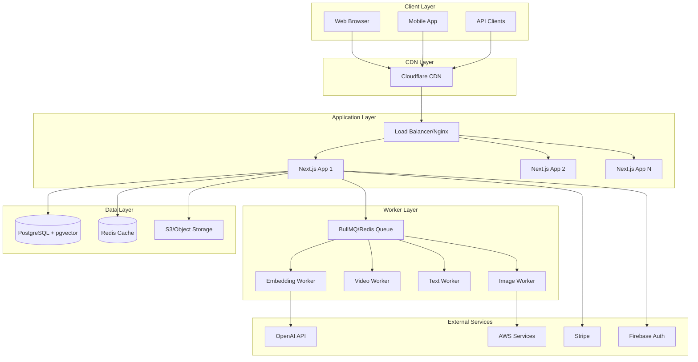
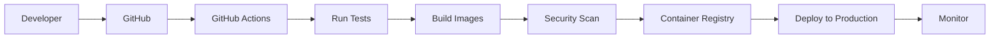

# Phase 17: Operations & Monitoring

## 🎯 Phase Overview
This final phase implements comprehensive operations procedures for the AI Media Search application. We'll establish production monitoring with Prometheus and Grafana, configure alerting and incident response, implement backup and recovery procedures, create complete documentation, optimize performance, and set up support systems. This ensures the application runs reliably at scale with proper observability and rapid incident response.

## ✅ Prerequisites
- Phase 16 completed (Production deployment)
- Application running in production
- Monitoring infrastructure deployed
- Access to production systems
- Notification channels configured (Slack, email, SMS)
- Support ticketing system account

## 📋 Phase Checklist
- [ ] Configure comprehensive monitoring dashboards
- [ ] Set up alerting rules and escalation
- [ ] Implement log aggregation and analysis
- [ ] Create operational runbooks
- [ ] Establish backup and recovery procedures
- [ ] Document system architecture
- [ ] Implement performance monitoring
- [ ] Set up support and feedback systems

---

## Step 1: Production Monitoring Stack

### 1.1 Configure Prometheus Metrics Collection
Create `deployment/production/monitoring/prometheus/prometheus.yml`:

```yaml
# Prometheus Configuration for AI Media Search

global:
  scrape_interval: 15s
  evaluation_interval: 15s
  external_labels:
    environment: 'production'
    application: 'ai-media-search'

# Alertmanager configuration
alerting:
  alertmanagers:
    - static_configs:
        - targets:
            - alertmanager:9093

# Load rules
rule_files:
  - "rules/*.yml"

# Scrape configurations
scrape_configs:
  # Application metrics
  - job_name: 'app'
    static_configs:
      - targets: ['app:3000']
    metrics_path: '/api/metrics'
    scrape_interval: 30s
    scrape_timeout: 10s

  # Node Exporter (System metrics)
  - job_name: 'node'
    static_configs:
      - targets: ['node-exporter:9100']

  # PostgreSQL Exporter
  - job_name: 'postgres'
    static_configs:
      - targets: ['postgres-exporter:9187']

  # Redis Exporter
  - job_name: 'redis'
    static_configs:
      - targets: ['redis-exporter:9121']

  # Nginx Exporter
  - job_name: 'nginx'
    static_configs:
      - targets: ['nginx-exporter:9113']

  # Docker metrics
  - job_name: 'docker'
    static_configs:
      - targets: ['docker-host:9323']

  # Blackbox Exporter (Uptime monitoring)
  - job_name: 'blackbox'
    metrics_path: /probe
    params:
      module: [http_2xx]
    static_configs:
      - targets:
          - https://example.com
          - https://example.com/api/health
          - https://example.com/api/auth/providers
    relabel_configs:
      - source_labels: [__address__]
        target_label: __param_target
      - source_labels: [__param_target]
        target_label: instance
      - target_label: __address__
        replacement: blackbox-exporter:9115
```

### 1.2 Create Application Metrics Endpoint
Create `src/app/api/metrics/route.ts`:

```typescript
import { NextRequest, NextResponse } from 'next/server';
import { register, collectDefaultMetrics, Counter, Gauge, Histogram } from 'prom-client';
import { db } from '@/lib/db';
import { getRedisClient } from '@/lib/cache/redis-client';

// Initialize default metrics
collectDefaultMetrics({ prefix: 'aimedisearch_' });

// Custom metrics
const httpRequestDuration = new Histogram({
  name: 'aimedisearch_http_request_duration_seconds',
  help: 'Duration of HTTP requests in seconds',
  labelNames: ['method', 'route', 'status_code'],
  buckets: [0.1, 0.5, 1, 2, 5]
});

const httpRequestTotal = new Counter({
  name: 'aimedisearch_http_requests_total',
  help: 'Total number of HTTP requests',
  labelNames: ['method', 'route', 'status_code']
});

const activeUsers = new Gauge({
  name: 'aimedisearch_active_users',
  help: 'Number of active users in the last 5 minutes'
});

const mediaItemsTotal = new Gauge({
  name: 'aimedisearch_media_items_total',
  help: 'Total number of media items',
  labelNames: ['status', 'type']
});

const searchQueriesTotal = new Counter({
  name: 'aimedisearch_search_queries_total',
  help: 'Total number of search queries',
  labelNames: ['status']
});

const uploadBytesTotal = new Counter({
  name: 'aimedisearch_upload_bytes_total',
  help: 'Total bytes uploaded'
});

const processingQueueSize = new Gauge({
  name: 'aimedisearch_processing_queue_size',
  help: 'Number of items in processing queue',
  labelNames: ['queue_name', 'status']
});

const apiErrors = new Counter({
  name: 'aimedisearch_api_errors_total',
  help: 'Total number of API errors',
  labelNames: ['endpoint', 'error_type']
});

const costTotal = new Gauge({
  name: 'aimedisearch_cost_total_usd',
  help: 'Total cost in USD',
  labelNames: ['service', 'operation']
});

// Export metrics handler
export async function GET(request: NextRequest) {
  try {
    // Update custom metrics
    await updateMetrics();
    
    // Return metrics in Prometheus format
    const metrics = await register.metrics();
    
    return new NextResponse(metrics, {
      headers: {
        'Content-Type': register.contentType,
      },
    });
  } catch (error) {
    console.error('Failed to collect metrics:', error);
    return NextResponse.json(
      { error: 'Failed to collect metrics' },
      { status: 500 }
    );
  }
}

async function updateMetrics() {
  try {
    // Active users
    const activeUsersResult = await db('users')
      .join('media_items', 'users.id', 'media_items.user_id')
      .where('media_items.created_at', '>', new Date(Date.now() - 5 * 60 * 1000))
      .countDistinct('users.id as count')
      .first();
    activeUsers.set(parseInt(activeUsersResult?.count || '0'));

    // Media items by status and type
    const mediaStats = await db('media_items')
      .select('processing_status', 'mime_type')
      .count('* as count')
      .groupBy('processing_status', 'mime_type');

    mediaStats.forEach(stat => {
      const type = stat.mime_type.split('/')[0];
      mediaItemsTotal.labels(stat.processing_status, type).set(parseInt(stat.count));
    });

    // Queue sizes
    const redis = getRedisClient();
    const queues = ['image-processing', 'video-processing', 'text-analysis', 'embedding-generation'];
    
    for (const queueName of queues) {
      const waiting = await redis.llen(`bull:${queueName}:wait`);
      const active = await redis.llen(`bull:${queueName}:active`);
      const completed = await redis.llen(`bull:${queueName}:completed`);
      const failed = await redis.llen(`bull:${queueName}:failed`);
      
      processingQueueSize.labels(queueName, 'waiting').set(waiting);
      processingQueueSize.labels(queueName, 'active').set(active);
      processingQueueSize.labels(queueName, 'completed').set(completed);
      processingQueueSize.labels(queueName, 'failed').set(failed);
    }

    // Cost metrics
    const costStats = await db('costs')
      .select('service', 'operation')
      .sum('cost as total')
      .where('created_at', '>', new Date(Date.now() - 24 * 60 * 60 * 1000))
      .groupBy('service', 'operation');

    costStats.forEach(stat => {
      costTotal.labels(stat.service, stat.operation).set(parseFloat(stat.total));
    });
  } catch (error) {
    console.error('Failed to update metrics:', error);
  }
}

// Export metrics for use in middleware
export { httpRequestDuration, httpRequestTotal, searchQueriesTotal, uploadBytesTotal, apiErrors };
```

### 1.3 Create Grafana Dashboards
Create `deployment/production/monitoring/dashboards/application-dashboard.json`:

```json
{
  "dashboard": {
    "id": null,
    "uid": "ai-media-search-app",
    "title": "AI Media Search - Application Overview",
    "timezone": "browser",
    "schemaVersion": 30,
    "version": 1,
    "panels": [
      {
        "gridPos": { "h": 8, "w": 12, "x": 0, "y": 0 },
        "id": 1,
        "title": "Request Rate",
        "type": "graph",
        "targets": [
          {
            "expr": "sum(rate(aimedisearch_http_requests_total[5m])) by (method)",
            "legendFormat": "{{method}}"
          }
        ],
        "yaxes": [{ "format": "reqps", "label": "Requests/sec" }]
      },
      {
        "gridPos": { "h": 8, "w": 12, "x": 12, "y": 0 },
        "id": 2,
        "title": "Response Time (p95)",
        "type": "graph",
        "targets": [
          {
            "expr": "histogram_quantile(0.95, sum(rate(aimedisearch_http_request_duration_seconds_bucket[5m])) by (route, le))",
            "legendFormat": "{{route}}"
          }
        ],
        "yaxes": [{ "format": "s", "label": "Seconds" }]
      },
      {
        "gridPos": { "h": 8, "w": 8, "x": 0, "y": 8 },
        "id": 3,
        "title": "Active Users",
        "type": "stat",
        "targets": [
          {
            "expr": "aimedisearch_active_users"
          }
        ],
        "options": {
          "graphMode": "area",
          "colorMode": "value",
          "fields": "",
          "values": false,
          "calcs": ["lastNotNull"]
        }
      },
      {
        "gridPos": { "h": 8, "w": 8, "x": 8, "y": 8 },
        "id": 4,
        "title": "Media Items",
        "type": "piechart",
        "targets": [
          {
            "expr": "sum(aimedisearch_media_items_total) by (type)",
            "legendFormat": "{{type}}"
          }
        ]
      },
      {
        "gridPos": { "h": 8, "w": 8, "x": 16, "y": 8 },
        "id": 5,
        "title": "Processing Queue",
        "type": "bargauge",
        "targets": [
          {
            "expr": "sum(aimedisearch_processing_queue_size{status=\"waiting\"}) by (queue_name)",
            "legendFormat": "{{queue_name}}"
          }
        ]
      },
      {
        "gridPos": { "h": 8, "w": 12, "x": 0, "y": 16 },
        "id": 6,
        "title": "Search Query Rate",
        "type": "graph",
        "targets": [
          {
            "expr": "sum(rate(aimedisearch_search_queries_total[5m])) by (status)",
            "legendFormat": "{{status}}"
          }
        ]
      },
      {
        "gridPos": { "h": 8, "w": 12, "x": 12, "y": 16 },
        "id": 7,
        "title": "API Errors",
        "type": "graph",
        "targets": [
          {
            "expr": "sum(rate(aimedisearch_api_errors_total[5m])) by (endpoint)",
            "legendFormat": "{{endpoint}}"
          }
        ]
      },
      {
        "gridPos": { "h": 8, "w": 24, "x": 0, "y": 24 },
        "id": 8,
        "title": "Cost by Service (24h)",
        "type": "bargraph",
        "targets": [
          {
            "expr": "sum(aimedisearch_cost_total_usd) by (service)",
            "legendFormat": "{{service}}"
          }
        ],
        "fieldConfig": {
          "defaults": {
            "unit": "currencyUSD"
          }
        }
      }
    ]
  }
}
```

### 1.4 Create System Dashboard
Create `deployment/production/monitoring/dashboards/system-dashboard.json`:

```json
{
  "dashboard": {
    "id": null,
    "uid": "ai-media-search-system",
    "title": "AI Media Search - System Metrics",
    "panels": [
      {
        "gridPos": { "h": 8, "w": 12, "x": 0, "y": 0 },
        "title": "CPU Usage",
        "type": "graph",
        "targets": [
          {
            "expr": "100 - (avg by (instance) (irate(node_cpu_seconds_total{mode=\"idle\"}[5m])) * 100)",
            "legendFormat": "{{instance}}"
          }
        ],
        "yaxes": [{ "format": "percent", "max": 100 }]
      },
      {
        "gridPos": { "h": 8, "w": 12, "x": 12, "y": 0 },
        "title": "Memory Usage",
        "type": "graph",
        "targets": [
          {
            "expr": "(1 - (node_memory_MemAvailable_bytes / node_memory_MemTotal_bytes)) * 100",
            "legendFormat": "Memory Used %"
          }
        ],
        "yaxes": [{ "format": "percent", "max": 100 }]
      },
      {
        "gridPos": { "h": 8, "w": 12, "x": 0, "y": 8 },
        "title": "Disk Usage",
        "type": "graph",
        "targets": [
          {
            "expr": "100 - ((node_filesystem_avail_bytes{mountpoint=\"/\"} * 100) / node_filesystem_size_bytes{mountpoint=\"/\"})",
            "legendFormat": "Root filesystem"
          }
        ],
        "yaxes": [{ "format": "percent", "max": 100 }]
      },
      {
        "gridPos": { "h": 8, "w": 12, "x": 12, "y": 8 },
        "title": "Network Traffic",
        "type": "graph",
        "targets": [
          {
            "expr": "irate(node_network_receive_bytes_total[5m])",
            "legendFormat": "RX {{device}}"
          },
          {
            "expr": "-irate(node_network_transmit_bytes_total[5m])",
            "legendFormat": "TX {{device}}"
          }
        ],
        "yaxes": [{ "format": "binBps" }]
      },
      {
        "gridPos": { "h": 8, "w": 12, "x": 0, "y": 16 },
        "title": "PostgreSQL Connections",
        "type": "graph",
        "targets": [
          {
            "expr": "pg_stat_database_numbackends{datname=\"ai_media_search\"}",
            "legendFormat": "Active connections"
          },
          {
            "expr": "pg_settings_max_connections",
            "legendFormat": "Max connections"
          }
        ]
      },
      {
        "gridPos": { "h": 8, "w": 12, "x": 12, "y": 16 },
        "title": "Redis Memory Usage",
        "type": "graph",
        "targets": [
          {
            "expr": "redis_memory_used_bytes",
            "legendFormat": "Used"
          },
          {
            "expr": "redis_memory_max_bytes",
            "legendFormat": "Max"
          }
        ],
        "yaxes": [{ "format": "decbytes" }]
      }
    ]
  }
}
```

---

## Step 2: Alerting & Incident Response

### 2.1 Create Prometheus Alert Rules
Create `deployment/production/monitoring/prometheus/rules/alerts.yml`:

```yaml
groups:
  - name: application
    interval: 30s
    rules:
      # High error rate
      - alert: HighErrorRate
        expr: |
          (sum(rate(aimedisearch_api_errors_total[5m])) 
          / 
          sum(rate(aimedisearch_http_requests_total[5m]))) > 0.05
        for: 5m
        labels:
          severity: critical
          team: backend
        annotations:
          summary: "High error rate detected"
          description: "Error rate is {{ $value | humanizePercentage }} for the last 5 minutes"
          runbook_url: "https://wiki.example.com/runbooks/high-error-rate"

      # Slow response time
      - alert: SlowResponseTime
        expr: |
          histogram_quantile(0.95,
            sum(rate(aimedisearch_http_request_duration_seconds_bucket[5m])) by (le)
          ) > 2
        for: 10m
        labels:
          severity: warning
          team: backend
        annotations:
          summary: "95th percentile response time is high"
          description: "95th percentile response time is {{ $value }}s"

      # Search failures
      - alert: SearchFailures
        expr: |
          sum(rate(aimedisearch_search_queries_total{status="failed"}[5m])) > 0.1
        for: 5m
        labels:
          severity: critical
          team: backend
        annotations:
          summary: "Search queries are failing"
          description: "{{ $value }} searches per second are failing"

      # Processing queue backlog
      - alert: ProcessingQueueBacklog
        expr: |
          sum(aimedisearch_processing_queue_size{status="waiting"}) > 1000
        for: 15m
        labels:
          severity: warning
          team: backend
        annotations:
          summary: "Large processing queue backlog"
          description: "{{ $value }} items waiting in processing queues"

      # High cost rate
      - alert: HighCostRate
        expr: |
          sum(rate(aimedisearch_cost_total_usd[1h])) * 3600 * 24 > 50
        for: 30m
        labels:
          severity: warning
          team: finance
        annotations:
          summary: "High cost rate detected"
          description: "Projected daily cost is ${{ $value | printf \"%.2f\" }}"

  - name: infrastructure
    interval: 30s
    rules:
      # Service down
      - alert: ServiceDown
        expr: up == 0
        for: 1m
        labels:
          severity: critical
          team: devops
        annotations:
          summary: "Service {{ $labels.job }} is down"
          description: "{{ $labels.instance }} has been down for more than 1 minute"

      # High CPU usage
      - alert: HighCPUUsage
        expr: |
          100 - (avg by (instance) (irate(node_cpu_seconds_total{mode="idle"}[5m])) * 100) > 80
        for: 10m
        labels:
          severity: warning
          team: devops
        annotations:
          summary: "High CPU usage on {{ $labels.instance }}"
          description: "CPU usage is {{ $value | printf \"%.0f\" }}%"

      # High memory usage
      - alert: HighMemoryUsage
        expr: |
          (1 - (node_memory_MemAvailable_bytes / node_memory_MemTotal_bytes)) * 100 > 85
        for: 10m
        labels:
          severity: warning
          team: devops
        annotations:
          summary: "High memory usage on {{ $labels.instance }}"
          description: "Memory usage is {{ $value | printf \"%.0f\" }}%"

      # Disk space low
      - alert: DiskSpaceLow
        expr: |
          100 - ((node_filesystem_avail_bytes{mountpoint="/"} * 100) 
          / node_filesystem_size_bytes{mountpoint="/"}) > 85
        for: 5m
        labels:
          severity: warning
          team: devops
        annotations:
          summary: "Low disk space on {{ $labels.instance }}"
          description: "Disk usage is {{ $value | printf \"%.0f\" }}%"

      # Database connection pool exhausted
      - alert: DatabaseConnectionPoolExhausted
        expr: |
          pg_stat_database_numbackends{datname="ai_media_search"} 
          / pg_settings_max_connections > 0.8
        for: 5m
        labels:
          severity: critical
          team: backend
        annotations:
          summary: "Database connection pool nearly exhausted"
          description: "{{ $value | humanizePercentage }} of connections in use"

      # Redis memory full
      - alert: RedisMemoryFull
        expr: |
          redis_memory_used_bytes / redis_memory_max_bytes > 0.9
        for: 5m
        labels:
          severity: critical
          team: backend
        annotations:
          summary: "Redis memory nearly full"
          description: "Redis memory usage is {{ $value | humanizePercentage }}"

      # SSL certificate expiring
      - alert: SSLCertificateExpiring
        expr: |
          probe_ssl_earliest_cert_expiry - time() < 86400 * 30
        for: 1h
        labels:
          severity: warning
          team: devops
        annotations:
          summary: "SSL certificate expiring soon"
          description: "SSL certificate for {{ $labels.instance }} expires in {{ $value | humanizeDuration }}"

  - name: business
    interval: 1m
    rules:
      # No uploads
      - alert: NoUploads
        expr: |
          sum(rate(aimedisearch_upload_bytes_total[1h])) == 0
        for: 2h
        labels:
          severity: warning
          team: product
        annotations:
          summary: "No uploads in the last 2 hours"
          description: "No files have been uploaded in the last 2 hours"

      # Subscription failures
      - alert: SubscriptionPaymentFailures
        expr: |
          sum(increase(stripe_webhook_payment_failed_total[1h])) > 5
        for: 30m
        labels:
          severity: critical
          team: finance
        annotations:
          summary: "Multiple subscription payment failures"
          description: "{{ $value }} payment failures in the last hour"
```

### 2.2 Configure AlertManager
Create `deployment/production/monitoring/alertmanager/alertmanager.yml`:

```yaml
global:
  resolve_timeout: 5m
  slack_api_url: '${SLACK_WEBHOOK}'
  smtp_from: 'alerts@example.com'
  smtp_smarthost: 'smtp.sendgrid.net:587'
  smtp_auth_username: 'apikey'
  smtp_auth_password: '${SENDGRID_API_KEY}'

templates:
  - '/etc/alertmanager/templates/*.tmpl'

route:
  group_by: ['alertname', 'severity']
  group_wait: 10s
  group_interval: 5m
  repeat_interval: 1h
  receiver: 'default'
  
  routes:
    # Critical alerts
    - match:
        severity: critical
      receiver: 'critical'
      continue: true
      group_wait: 0s
      repeat_interval: 15m

    # Team-specific routing
    - match:
        team: backend
      receiver: 'backend-team'
      
    - match:
        team: devops
      receiver: 'devops-team'
      
    - match:
        team: finance
      receiver: 'finance-team'

receivers:
  - name: 'default'
    slack_configs:
      - channel: '#alerts'
        title: 'AI Media Search Alert'
        text: '{{ range .Alerts }}{{ .Annotations.summary }}{{ end }}'
        send_resolved: true

  - name: 'critical'
    email_configs:
      - to: 'oncall@example.com'
        headers:
          Subject: 'CRITICAL: {{ .GroupLabels.alertname }}'
    pagerduty_configs:
      - service_key: '${PAGERDUTY_SERVICE_KEY}'
        description: '{{ .GroupLabels.alertname }}: {{ range .Alerts }}{{ .Annotations.summary }}{{ end }}'
    slack_configs:
      - channel: '#alerts-critical'
        title: '🚨 CRITICAL ALERT'
        color: 'danger'
        text: '{{ range .Alerts }}{{ .Annotations.summary }}{{ end }}'

  - name: 'backend-team'
    slack_configs:
      - channel: '#backend-alerts'
        title: 'Backend Alert: {{ .GroupLabels.alertname }}'
        text: '{{ range .Alerts }}{{ .Annotations.description }}{{ end }}'
        actions:
          - type: button
            text: 'View Dashboard'
            url: 'https://example.com/grafana'
          - type: button
            text: 'Runbook'
            url: '{{ (index .Alerts 0).Annotations.runbook_url }}'

  - name: 'devops-team'
    slack_configs:
      - channel: '#devops-alerts'
        title: 'Infrastructure Alert: {{ .GroupLabels.alertname }}'
        text: '{{ range .Alerts }}{{ .Annotations.description }}{{ end }}'

  - name: 'finance-team'
    email_configs:
      - to: 'finance-alerts@example.com'
        headers:
          Subject: 'Cost Alert: {{ .GroupLabels.alertname }}'
    slack_configs:
      - channel: '#finance-alerts'
        title: 'Cost Alert'
        text: '{{ range .Alerts }}{{ .Annotations.description }}{{ end }}'

inhibit_rules:
  - source_match:
      severity: 'critical'
    target_match:
      severity: 'warning'
    equal: ['alertname', 'instance']
```

### 2.3 Create Incident Response Runbooks
Create `deployment/production/runbooks/high-error-rate.md`:

```markdown
# Runbook: High Error Rate

## Alert Information
- **Alert Name**: HighErrorRate
- **Severity**: Critical
- **Team**: Backend

## Overview
This alert fires when the API error rate exceeds 5% for 5 minutes or more.

## Impact
- Users may experience failed requests
- Some features may be unavailable
- Data processing may be delayed

## Diagnosis Steps

1. **Check Grafana Dashboard**
   ```bash
   open https://example.com/grafana/d/ai-media-search-app
   ```
   - Look at the "API Errors" panel
   - Identify which endpoints are failing

2. **Check Application Logs**
   ```bash
   ssh aimediadeploy@example.com
   docker logs ai-media-search-app --tail 1000 | grep ERROR
   ```

3. **Check Database Status**
   ```bash
   docker exec ai-media-search-postgres pg_isready
   docker logs ai-media-search-postgres --tail 100
   ```

4. **Check Redis Status**
   ```bash
   docker exec ai-media-search-redis redis-cli ping
   ```

5. **Check External Services**
   - AWS S3: https://status.aws.amazon.com/
   - Stripe: https://status.stripe.com/
   - OpenAI: https://status.openai.com/

## Resolution Steps

### If Database Connection Issues:
1. Check connection pool:
   ```bash
   docker exec ai-media-search-postgres psql -U aimediadmin -d ai_media_search \
     -c "SELECT count(*) FROM pg_stat_activity;"
   ```

2. If pool exhausted, restart pgbouncer:
   ```bash
   docker restart ai-media-search-pgbouncer
   ```

3. If database is down, check disk space:
   ```bash
   df -h
   docker exec ai-media-search-postgres df -h /var/lib/postgresql/data
   ```

### If Redis Issues:
1. Check memory usage:
   ```bash
   docker exec ai-media-search-redis redis-cli info memory
   ```

2. If memory full, flush least recently used:
   ```bash
   docker exec ai-media-search-redis redis-cli --scan --pattern "cache:*" | \
     head -1000 | xargs docker exec ai-media-search-redis redis-cli del
   ```

### If External Service Issues:
1. Check service status pages
2. Implement circuit breaker if not responding
3. Switch to fallback/degraded mode

### If Application Bug:
1. Check recent deployments:
   ```bash
   docker images | grep ai-media-search
   ```

2. Rollback if necessary:
   ```bash
   cd /opt/ai-media-search
   ./scripts/rollback.sh
   ```

## Escalation
- After 15 minutes: Page on-call engineer
- After 30 minutes: Page team lead
- After 1 hour: Page CTO

## Post-Incident
1. Create incident report
2. Update this runbook with findings
3. Schedule post-mortem meeting
4. Create tickets for preventive measures
```

### 2.4 Create On-Call Schedule
Create `deployment/production/monitoring/on-call-schedule.yml`:

```yaml
# On-Call Schedule Configuration

schedule:
  name: "AI Media Search On-Call"
  timezone: "America/New_York"
  
  rotations:
    - name: "Primary"
      participants:
        - email: "alice@example.com"
          phone: "+1234567890"
          slack: "@alice"
        - email: "bob@example.com"
          phone: "+1234567891"
          slack: "@bob"
        - email: "charlie@example.com"
          phone: "+1234567892"
          slack: "@charlie"
      type: "weekly"
      handoff_day: "Monday"
      handoff_time: "09:00"
    
    - name: "Secondary"
      participants:
        - email: "dave@example.com"
          phone: "+1234567893"
          slack: "@dave"
        - email: "eve@example.com"
          phone: "+1234567894"
          slack: "@eve"
      type: "weekly"
      handoff_day: "Monday"
      handoff_time: "09:00"

escalation_policy:
  - level: 1
    escalate_after: 15
    targets:
      - rotation: "Primary"
  - level: 2
    escalate_after: 30
    targets:
      - rotation: "Secondary"
      - rotation: "Primary"
  - level: 3
    escalate_after: 60
    targets:
      - email: "cto@example.com"
        phone: "+1234567899"

notification_rules:
  - urgency: "high"
    contact_method: ["sms", "phone", "slack", "email"]
  - urgency: "low"
    contact_method: ["slack", "email"]
```

---

## Step 3: Log Management

### 3.1 Configure Centralized Logging
Create `deployment/production/monitoring/logging/fluent-bit.conf`:

```conf
[SERVICE]
    Flush        5
    Daemon       Off
    Log_Level    info
    Parsers_File parsers.conf

[INPUT]
    Name              forward
    Listen            0.0.0.0
    Port              24224
    Buffer_Chunk_Size 1M
    Buffer_Max_Size   6M

[INPUT]
    Name              tail
    Path              /var/log/nginx/access.log
    Parser            nginx
    Tag               nginx.access
    Refresh_Interval  5
    Mem_Buf_Limit     10MB
    Skip_Long_Lines   On

[INPUT]
    Name              tail
    Path              /var/log/nginx/error.log
    Tag               nginx.error
    Refresh_Interval  5
    Mem_Buf_Limit     5MB

[INPUT]
    Name              systemd
    Tag               host.*
    Systemd_Filter    _SYSTEMD_UNIT=docker.service
    Read_From_Tail    On

[FILTER]
    Name              parser
    Match             docker.*
    Key_Name          log
    Parser            docker
    Reserve_Data      On

[FILTER]
    Name              record_modifier
    Match             *
    Record hostname ${HOSTNAME}
    Record environment production
    Record application ai-media-search

[FILTER]
    Name              grep
    Match             app.*
    Exclude           log health check

[OUTPUT]
    Name              es
    Match             *
    Host              elasticsearch
    Port              9200
    Index             ai-media-search
    Type              _doc
    Retry_Limit       5
    Buffer_Size       5MB

[OUTPUT]
    Name              s3
    Match             nginx.*
    bucket            ai-media-search-logs
    region            us-east-1
    total_file_size   50M
    upload_timeout    10m
    use_put_object    On

[OUTPUT]
    Name              cloudwatch_logs
    Match             app.*
    region            us-east-1
    log_group_name    /aws/ecs/ai-media-search
    log_stream_prefix ${HOSTNAME}-
    auto_create_group On
```

### 3.2 Create Log Analysis Queries
Create `deployment/production/monitoring/logging/queries.md`:

```markdown
# Common Log Analysis Queries

## Elasticsearch/OpenSearch Queries

### Find all errors in the last hour
```json
{
  "query": {
    "bool": {
      "must": [
        { "match": { "level": "error" } },
        { "range": { "@timestamp": { "gte": "now-1h" } } }
      ]
    }
  },
  "sort": [{ "@timestamp": { "order": "desc" } }],
  "size": 100
}
```

### Find slow API requests
```json
{
  "query": {
    "bool": {
      "must": [
        { "match": { "type": "api_request" } },
        { "range": { "duration": { "gte": 1000 } } }
      ]
    }
  },
  "aggs": {
    "by_endpoint": {
      "terms": { "field": "endpoint.keyword" },
      "aggs": {
        "avg_duration": { "avg": { "field": "duration" } }
      }
    }
  }
}
```

### Track user activity
```json
{
  "query": {
    "match": { "user_id": "USER_ID_HERE" }
  },
  "aggs": {
    "actions": {
      "terms": { "field": "action.keyword" },
      "aggs": {
        "over_time": {
          "date_histogram": {
            "field": "@timestamp",
            "calendar_interval": "hour"
          }
        }
      }
    }
  }
}
```

### Find failed uploads
```json
{
  "query": {
    "bool": {
      "must": [
        { "match": { "action": "upload" } },
        { "match": { "status": "failed" } }
      ]
    }
  },
  "aggs": {
    "failure_reasons": {
      "terms": { "field": "error.keyword" }
    }
  }
}
```

## CloudWatch Insights Queries

### Application errors by type
```
fields @timestamp, error.type, error.message, user_id
| filter level = "error"
| stats count() by error.type
| sort count desc
```

### API latency percentiles
```
fields @timestamp, endpoint, duration
| filter type = "api_request"
| stats avg(duration), pct(duration, 50), pct(duration, 95), pct(duration, 99) by endpoint
| sort avg desc
```

### Cost by service over time
```
fields @timestamp, service, operation, cost
| filter type = "cost_tracking"
| stats sum(cost) by bin(1h), service
| sort bin desc
```

### User search patterns
```
fields @timestamp, user_id, search_query, results_count
| filter action = "search"
| stats count() by search_query
| sort count desc
| limit 20
```
```

### 3.3 Create Log Retention Policy
Create `deployment/production/monitoring/logging/retention-policy.sh`:

```bash
#!/bin/bash
set -e

# Log Retention Policy Implementation

# Configuration
ES_HOST="localhost:9200"
S3_BUCKET="ai-media-search-logs"
RETENTION_DAYS_HOT=7
RETENTION_DAYS_WARM=30
RETENTION_DAYS_COLD=90

log() {
    echo "[$(date +'%Y-%m-%d %H:%M:%S')] $1"
}

# Elasticsearch Index Lifecycle Management
configure_ilm() {
    log "Configuring Index Lifecycle Management..."
    
    curl -X PUT "$ES_HOST/_ilm/policy/ai-media-search-policy" \
         -H 'Content-Type: application/json' \
         -d @- <<EOF
{
  "policy": {
    "phases": {
      "hot": {
        "min_age": "0ms",
        "actions": {
          "rollover": {
            "max_age": "1d",
            "max_size": "50GB"
          },
          "set_priority": {
            "priority": 100
          }
        }
      },
      "warm": {
        "min_age": "${RETENTION_DAYS_HOT}d",
        "actions": {
          "shrink": {
            "number_of_shards": 1
          },
          "forcemerge": {
            "max_num_segments": 1
          },
          "set_priority": {
            "priority": 50
          },
          "allocate": {
            "number_of_replicas": 1,
            "require": {
              "data": "warm"
            }
          }
        }
      },
      "cold": {
        "min_age": "${RETENTION_DAYS_WARM}d",
        "actions": {
          "set_priority": {
            "priority": 0
          },
          "allocate": {
            "number_of_replicas": 0,
            "require": {
              "data": "cold"
            }
          },
          "searchable_snapshot": {
            "snapshot_repository": "s3-repository"
          }
        }
      },
      "delete": {
        "min_age": "${RETENTION_DAYS_COLD}d",
        "actions": {
          "delete": {}
        }
      }
    }
  }
}
EOF
}

# S3 Lifecycle Rules
configure_s3_lifecycle() {
    log "Configuring S3 lifecycle rules..."
    
    aws s3api put-bucket-lifecycle-configuration \
        --bucket "$S3_BUCKET" \
        --lifecycle-configuration file:///dev/stdin <<EOF
{
  "Rules": [
    {
      "ID": "ArchiveOldLogs",
      "Status": "Enabled",
      "Transitions": [
        {
          "Days": 30,
          "StorageClass": "STANDARD_IA"
        },
        {
          "Days": 90,
          "StorageClass": "GLACIER"
        }
      ],
      "Expiration": {
        "Days": 365
      }
    },
    {
      "ID": "DeleteIncompleteMultipartUploads",
      "Status": "Enabled",
      "AbortIncompleteMultipartUpload": {
        "DaysAfterInitiation": 7
      }
    }
  ]
}
EOF
}

# Archive old logs
archive_old_logs() {
    log "Archiving old logs..."
    
    # Find logs older than 30 days
    find /var/log/ai-media-search -name "*.log" -mtime +30 -type f | while read -r logfile; do
        # Compress and upload to S3
        gzip -c "$logfile" | aws s3 cp - "s3://$S3_BUCKET/archive/$(basename $logfile).gz"
        
        # Remove local file
        rm -f "$logfile"
    done
}

# Clean up Docker logs
cleanup_docker_logs() {
    log "Cleaning up Docker logs..."
    
    # Find containers with large logs
    docker ps -q | xargs -I {} sh -c '
        LOG_SIZE=$(docker inspect {} --format="{{.LogPath}}" | xargs ls -l | awk "{print \$5}")
        if [ "$LOG_SIZE" -gt 1073741824 ]; then  # 1GB
            echo "Truncating logs for container {}"
            echo "" > $(docker inspect {} --format="{{.LogPath}}")
        fi
    '
}

# Main execution
main() {
    log "Starting log retention tasks..."
    
    configure_ilm
    configure_s3_lifecycle
    archive_old_logs
    cleanup_docker_logs
    
    log "Log retention tasks completed"
}

main
```

---

## Step 4: Operational Procedures

### 4.1 Create Backup and Recovery Procedures
Create `deployment/production/procedures/backup-recovery.md`:

```markdown
# Backup and Recovery Procedures

## Backup Schedule

### Automated Backups
- **Database**: Daily at 2:00 AM UTC
- **Media Files**: Continuous sync to S3/B2
- **Configuration**: Weekly on Sundays
- **Logs**: Daily rotation and archive

### Manual Backup Triggers
- Before major deployments
- Before database migrations
- On-demand via scripts

## Backup Locations

### Primary Backups
- Database: S3 bucket `ai-media-search-backups/database/`
- Media: S3 bucket `ai-media-search-media/`
- Configs: S3 bucket `ai-media-search-backups/configs/`

### Secondary Backups (Geographic redundancy)
- Database: Backblaze B2 `ai-media-search-dr/database/`
- Media: Backblaze B2 `ai-media-search-dr/media/`

## Recovery Procedures

### Database Recovery

#### Point-in-Time Recovery
```bash
# 1. Stop application
docker-compose -f docker-compose.prod.yml stop app workers

# 2. List available backups
aws s3 ls s3://ai-media-search-backups/database/

# 3. Restore to specific time
./scripts/restore.sh ai_media_search_20240115_020000.sql.gz

# 4. Verify restoration
docker exec ai-media-search-postgres psql -U aimediadmin -d ai_media_search \
  -c "SELECT COUNT(*) FROM users;"

# 5. Restart application
docker-compose -f docker-compose.prod.yml up -d
```

#### Disaster Recovery (Full System)
```bash
# 1. Provision new infrastructure
cd deployment/production/infrastructure/vps
./setup.sh

# 2. Restore database from backup
./scripts/restore.sh latest

# 3. Sync media files
aws s3 sync s3://ai-media-search-media/ /opt/ai-media-search/media/

# 4. Deploy application
./scripts/deploy-production.sh v1.0.0

# 5. Update DNS
# Point domain to new server IP

# 6. Verify services
./scripts/smoke-test.sh example.com
```

### Media Files Recovery
```bash
# Single file recovery
aws s3 cp s3://ai-media-search-media/users/USER_ID/media/FILE_NAME /tmp/

# Bulk recovery
aws s3 sync s3://ai-media-search-media/users/USER_ID/ /opt/media/users/USER_ID/

# Verify integrity
md5sum -c /opt/backups/media-checksums.txt
```

## Recovery Time Objectives (RTO)

| Component | RTO | RPO | Method |
|-----------|-----|-----|---------|
| Database | 30 min | 1 hour | Automated backup restore |
| Media Files | 10 min | Real-time | S3 sync |
| Application | 15 min | N/A | Docker deployment |
| Full System | 2 hours | 1 hour | Complete DR procedure |

## Testing Schedule

### Monthly Tests
- Restore database to test environment
- Verify backup integrity
- Test single file recovery

### Quarterly Tests
- Full disaster recovery drill
- Measure actual RTO/RPO
- Update procedures based on findings

### Annual Tests
- Complete infrastructure rebuild
- Cross-region failover
- Third-party security audit

## Backup Monitoring

### Automated Checks
```bash
# Check backup status
./scripts/check-backups.sh

# Expected output:
# ✓ Database backup: ai_media_search_20240115_020000.sql.gz (2.3GB)
# ✓ Media sync: 12,345 files synced (45.6GB)
# ✓ Config backup: configs_20240114.tar.gz (1.2MB)
# ✓ All backups healthy
```

### Alert Conditions
- Backup job failure
- Backup size anomaly (>20% change)
- Backup age > 25 hours
- S3/B2 access errors
```

### 4.2 Create Maintenance Procedures
Create `deployment/production/procedures/maintenance.md`:

```markdown
# Maintenance Procedures

## Regular Maintenance Schedule

### Daily Tasks
- [ ] Check monitoring dashboards
- [ ] Review error logs
- [ ] Verify backup completion
- [ ] Check disk space

### Weekly Tasks
- [ ] Update dependencies (security patches)
- [ ] Database vacuum and analyze
- [ ] Review performance metrics
- [ ] Clean up old logs
- [ ] Test backup restoration

### Monthly Tasks
- [ ] Full system updates
- [ ] SSL certificate check
- [ ] Database index optimization
- [ ] Cost analysis review
- [ ] Security scan

### Quarterly Tasks
- [ ] Major version updates
- [ ] Capacity planning review
- [ ] Disaster recovery test
- [ ] Performance optimization

## Maintenance Windows

### Standard Window
- **Time**: Sundays 2:00-4:00 AM UTC
- **Duration**: 2 hours maximum
- **Notification**: 48 hours advance

### Emergency Maintenance
- **Authorization**: Requires CTO approval
- **Notification**: Immediate via status page
- **Duration**: As needed

## Database Maintenance

### Vacuum and Analyze
```bash
# Connect to database
docker exec -it ai-media-search-postgres psql -U aimediadmin -d ai_media_search

-- Vacuum and analyze all tables
VACUUM ANALYZE;

-- Check table sizes
SELECT 
    schemaname,
    tablename,
    pg_size_pretty(pg_total_relation_size(schemaname||'.'||tablename)) AS size
FROM pg_tables
WHERE schemaname = 'public'
ORDER BY pg_total_relation_size(schemaname||'.'||tablename) DESC;

-- Reindex if needed
REINDEX DATABASE ai_media_search;
```

### Connection Pool Tuning
```bash
# Edit pgbouncer config
vim /opt/ai-media-search/configs/pgbouncer.ini

# Reload configuration
docker exec ai-media-search-pgbouncer pgbouncer -R
```

## Dependency Updates

### Security Updates
```bash
# Check for security updates
docker run --rm -v /var/run/docker.sock:/var/run/docker.sock \
  aquasec/trivy image ghcr.io/org/ai-media-search-app:latest

# Update base images
docker pull node:18-alpine
docker pull postgres:15-alpine
docker pull redis:7-alpine

# Rebuild application
docker-compose -f docker-compose.prod.yml build --no-cache
```

### NPM Dependencies
```bash
# Check for updates
docker run --rm -v $(pwd):/app -w /app node:18-alpine npm audit

# Update dependencies
docker run --rm -v $(pwd):/app -w /app node:18-alpine npm update

# Test updates
docker run --rm -v $(pwd):/app -w /app node:18-alpine npm test
```

## Performance Optimization

### Database Query Optimization
```sql
-- Find slow queries
SELECT 
    query,
    calls,
    total_time,
    mean_time,
    max_time
FROM pg_stat_statements
WHERE mean_time > 100
ORDER BY mean_time DESC
LIMIT 20;

-- Check missing indexes
SELECT 
    schemaname,
    tablename,
    indexname,
    idx_scan
FROM pg_stat_user_indexes
WHERE idx_scan = 0
AND indexname NOT LIKE '%_pkey';
```

### Redis Memory Optimization
```bash
# Analyze memory usage
docker exec ai-media-search-redis redis-cli --bigkeys

# Clear expired keys
docker exec ai-media-search-redis redis-cli --scan --pattern "*" | \
  xargs -L 100 docker exec ai-media-search-redis redis-cli DEL
```

## Capacity Planning

### Metrics to Monitor
- CPU usage trends
- Memory utilization
- Disk I/O patterns
- Network bandwidth
- Database connections
- Queue lengths

### Scaling Triggers
- CPU > 70% for 1 hour
- Memory > 80% sustained
- Disk usage > 75%
- Response time p95 > 2s
- Queue backlog > 1000 items

### Scaling Procedures
```bash
# Horizontal scaling (add more app instances)
docker-compose -f docker-compose.prod.yml up -d --scale app=4

# Vertical scaling (requires downtime)
# 1. Update instance size in infrastructure
# 2. Stop services
# 3. Resize instance
# 4. Start services
```
```

---

## Step 5: Documentation Suite

### 5.1 Create User Documentation
Create `deployment/production/docs/user-guide.md`:

```markdown
# AI Media Search - User Guide

## Getting Started

### Creating an Account
1. Visit https://example.com
2. Click "Sign Up"
3. Enter your email and password
4. Verify your email address
5. Choose a subscription plan

### Uploading Media
1. Click the upload button or drag files onto the page
2. Supported formats:
   - Images: JPG, PNG, GIF, WebP (max 100MB)
   - Videos: MP4, MOV, AVI (max 5GB)
   - Documents: PDF, TXT, MD (max 50MB)
3. Files are automatically processed for search

### Searching Your Media
1. Use natural language queries:
   - "sunset photos from last summer"
   - "documents about project planning"
   - "videos with people speaking"
2. Use filters to refine results:
   - File type
   - Date range
   - Tags

## Features

### AI-Powered Search
- Searches content within images and videos
- Understands context and meaning
- Finds similar images automatically

### Organization
- Automatic tagging
- Custom tags and categories
- Collections for grouping related media

### Sharing
- Generate shareable links
- Set expiration dates
- Control download permissions

## Subscription Plans

### Free Tier
- 1GB storage
- 100 searches/month
- Basic AI features

### Pro Plan ($9.99/month)
- 100GB storage
- Unlimited searches
- Advanced AI features
- Priority processing

### Enterprise (Custom pricing)
- Unlimited storage
- API access
- Custom integrations
- Dedicated support

## Troubleshooting

### Upload Issues
- **Error: File too large**
  - Free tier: 10MB limit
  - Pro tier: 100MB images, 5GB videos
  
- **Error: Unsupported format**
  - Check supported formats list
  - Convert file to supported format

- **Upload stuck**
  - Check internet connection
  - Try smaller file first
  - Clear browser cache

### Search Problems
- **No results found**
  - Try broader search terms
  - Check date filters
  - Ensure files are processed (may take few minutes)

- **Irrelevant results**
  - Use more specific terms
  - Add filters
  - Use quotes for exact phrases

### Account Issues
- **Can't sign in**
  - Check email/password
  - Try password reset
  - Check if email is verified

- **Subscription not active**
  - Check payment method
  - Update billing information
  - Contact support

## Privacy & Security

### Data Protection
- All files encrypted at rest
- Secure transfer over HTTPS
- No employee access without permission

### Data Retention
- Files kept until you delete them
- Deleted files removed within 30 days
- Account deletion removes all data

### Sharing Security
- Links expire after set time
- Password protection available
- Access logs for shared content

## FAQ

**Q: How long does processing take?**
A: Usually 1-5 minutes for images, 5-15 minutes for videos

**Q: Can I search in multiple languages?**
A: Yes, AI understands 50+ languages

**Q: Is my data used for training?**
A: No, your data is never used for AI training

**Q: Can I export my data?**
A: Yes, use Account Settings > Export Data

**Q: How do I delete my account?**
A: Account Settings > Delete Account (permanent)

## Contact Support

- Email: support@example.com
- Response time: 24-48 hours
- Priority support for Pro/Enterprise

Include:
- Account email
- Description of issue
- Screenshots if applicable
- Browser/device information
```

### 5.2 Create API Documentation
Create `deployment/production/docs/api-reference.md`:

```markdown
# AI Media Search API Reference

## Authentication

All API requests require authentication using Bearer tokens.

```bash
curl -H "Authorization: Bearer YOUR_API_TOKEN" \
  https://api.example.com/v1/media
```

### Getting an API Token

```bash
POST /api/auth/token
Content-Type: application/json

{
  "email": "user@example.com",
  "password": "your-password"
}

Response:
{
  "token": "eyJhbGciOiJIUzI1NiIs...",
  "expires_at": "2024-01-20T00:00:00Z"
}
```

## Endpoints

### Upload Media

```bash
POST /api/upload/presigned
Content-Type: application/json
Authorization: Bearer TOKEN

{
  "filename": "sunset.jpg",
  "mimeType": "image/jpeg",
  "size": 1048576
}

Response:
{
  "uploadUrl": "https://s3.amazonaws.com/...",
  "mediaItemId": "123e4567-e89b-12d3-a456-426614174000",
  "expiresIn": 3600
}
```

### Search Media

```bash
POST /api/search
Content-Type: application/json
Authorization: Bearer TOKEN

{
  "query": "sunset beach photos",
  "filters": {
    "mediaType": ["image/jpeg", "image/png"],
    "dateRange": {
      "start": "2024-01-01",
      "end": "2024-01-31"
    },
    "minScore": 0.8
  },
  "limit": 20,
  "offset": 0
}

Response:
{
  "results": [
    {
      "id": "abc123",
      "score": 0.95,
      "mediaItem": {
        "id": "123e4567-e89b-12d3-a456-426614174000",
        "filename": "sunset.jpg",
        "mimeType": "image/jpeg",
        "createdAt": "2024-01-15T10:30:00Z"
      }
    }
  ],
  "totalCount": 42,
  "searchId": "search-123"
}
```

### Get Media Item

```bash
GET /api/media/{id}
Authorization: Bearer TOKEN

Response:
{
  "id": "123e4567-e89b-12d3-a456-426614174000",
  "filename": "sunset.jpg",
  "mimeType": "image/jpeg",
  "size": 1048576,
  "status": "completed",
  "metadata": {
    "labels": ["sunset", "beach", "ocean"],
    "colors": ["#FF6B35", "#F7B801", "#3E92CC"],
    "text": null
  },
  "viewUrl": "https://cdn.example.com/...",
  "createdAt": "2024-01-15T10:30:00Z"
}
```

### List Media

```bash
GET /api/media?page=1&limit=20&sort=created_at&order=desc
Authorization: Bearer TOKEN

Response:
{
  "items": [...],
  "pagination": {
    "page": 1,
    "limit": 20,
    "total": 156,
    "totalPages": 8
  }
}
```

## Rate Limits

| Endpoint | Free Tier | Pro Tier | Enterprise |
|----------|-----------|----------|------------|
| Upload | 10/hour | 100/hour | Unlimited |
| Search | 100/day | 1000/day | Unlimited |
| Media List | 1000/day | 10000/day | Unlimited |

## Error Codes

| Code | Message | Description |
|------|---------|-------------|
| 400 | Bad Request | Invalid parameters |
| 401 | Unauthorized | Invalid or missing token |
| 403 | Forbidden | Insufficient permissions |
| 404 | Not Found | Resource doesn't exist |
| 429 | Too Many Requests | Rate limit exceeded |
| 500 | Internal Error | Server error |

## Webhooks

Configure webhooks to receive real-time notifications:

```bash
POST /api/webhooks
Content-Type: application/json
Authorization: Bearer TOKEN

{
  "url": "https://your-app.com/webhook",
  "events": ["media.processed", "media.failed"],
  "secret": "your-webhook-secret"
}
```

### Webhook Events

- `media.uploaded` - File upload completed
- `media.processed` - AI processing completed
- `media.failed` - Processing failed
- `media.deleted` - File deleted

### Webhook Payload

```json
{
  "event": "media.processed",
  "timestamp": "2024-01-15T10:30:00Z",
  "data": {
    "mediaItemId": "123e4567-e89b-12d3-a456-426614174000",
    "userId": "user-123",
    "metadata": {...}
  }
}
```

## SDKs

### JavaScript/TypeScript

```bash
npm install @ai-media-search/sdk
```

```typescript
import { AIMediaSearch } from '@ai-media-search/sdk';

const client = new AIMediaSearch({
  apiKey: 'your-api-key'
});

// Search
const results = await client.search({
  query: 'sunset photos',
  limit: 20
});

// Upload
const { uploadUrl } = await client.createUpload({
  filename: 'photo.jpg',
  mimeType: 'image/jpeg',
  size: file.size
});
```

### Python

```bash
pip install ai-media-search
```

```python
from ai_media_search import Client

client = Client(api_key='your-api-key')

# Search
results = client.search(
    query='sunset photos',
    limit=20
)

# Upload
upload = client.create_upload(
    filename='photo.jpg',
    mime_type='image/jpeg',
    size=1048576
)
```

## Postman Collection

Download our Postman collection for easy API testing:
https://api.example.com/postman-collection.json
```

### 5.3 Create Architecture Documentation
Create `deployment/production/docs/architecture.md`:

```markdown
# AI Media Search - System Architecture

## Overview

AI Media Search is a cloud-native application built with microservices architecture, designed for scalability, reliability, and performance.

## Architecture Diagram



## Components

### Frontend (Next.js)
- **Technology**: Next.js 14, React 18, TypeScript
- **Styling**: Tailwind CSS
- **State Management**: Zustand
- **Features**:
  - Server-side rendering
  - API routes
  - Image optimization
  - Progressive Web App

### Backend Services

#### API Server
- RESTful API design
- JWT authentication
- Rate limiting
- Request validation
- Error handling

#### Queue Workers
- **Image Processing**: Rekognition integration
- **Video Processing**: Transcribe, thumbnail generation
- **Text Analysis**: Comprehend integration
- **Embedding Generation**: OpenAI integration

### Data Storage

#### PostgreSQL
- Primary data store
- pgvector for similarity search
- JSONB for flexible metadata
- Full-text search capabilities

#### Redis
- Session storage
- Cache layer
- Queue backend
- Real-time features

#### Object Storage (S3)
- Media file storage
- CDN origin
- Backup storage
- Log archives

## Security Architecture

### Network Security
- All traffic over HTTPS
- Cloudflare DDoS protection
- Rate limiting at multiple layers
- IP allowlisting for admin

### Application Security
- JWT token authentication
- Role-based access control
- Input validation
- SQL injection prevention
- XSS protection
- CSRF tokens

### Data Security
- Encryption at rest
- Encryption in transit
- Secure key management
- Regular security audits

## Scalability Design

### Horizontal Scaling
- Stateless application servers
- Load balancer distribution
- Auto-scaling groups
- Queue-based processing

### Vertical Scaling
- Database read replicas
- Redis cluster mode
- CDN edge locations
- Optimized instance types

### Performance Optimization
- Database query optimization
- Redis caching strategy
- CDN static assets
- Image optimization
- Lazy loading

## High Availability

### Redundancy
- Multiple availability zones
- Database replication
- Redis sentinel
- Cross-region backups

### Failover
- Health checks
- Automatic failover
- Circuit breakers
- Graceful degradation

### Monitoring
- Real-time metrics
- Custom dashboards
- Alerting rules
- Log aggregation

## Deployment Architecture

### CI/CD Pipeline


### Infrastructure as Code
- Terraform for AWS
- Docker for containerization
- Kubernetes manifests
- Ansible playbooks

## Technology Stack

### Languages & Frameworks
- TypeScript/JavaScript (Node.js)
- React (Frontend)
- PostgreSQL (SQL)
- Redis (Lua scripts)

### Key Libraries
- Next.js - React framework
- Prisma - ORM
- BullMQ - Queue system
- Sharp - Image processing
- Zod - Validation

### DevOps Tools
- Docker - Containerization
- Prometheus - Metrics
- Grafana - Visualization
- ELK Stack - Logging
- Terraform - IaC

## Decision Log

### Why Next.js?
- Built-in SSR/SSG
- API routes
- Image optimization
- Great DX

### Why PostgreSQL + pgvector?
- ACID compliance
- Vector search capabilities
- JSON support
- Proven reliability

### Why Redis?
- High performance
- Pub/sub support
- Data structures
- Queue backend

### Why Cloudflare?
- Global CDN
- DDoS protection
- Web firewall
- Edge computing

## Future Considerations

### Planned Improvements
- GraphQL API
- WebSocket support
- Mobile applications
- ML model hosting

### Scaling Preparations
- Kubernetes migration
- Multi-region deployment
- Event sourcing
- CQRS pattern
```

---

## Step 6: Performance & Optimization

### 6.1 Create Performance Monitoring
Create `deployment/production/monitoring/performance/performance-monitor.sh`:

```bash
#!/bin/bash
set -e

# Performance Monitoring Script

# Configuration
DOMAIN="${1:-example.com}"
RESULTS_DIR="/opt/monitoring/performance"
SLACK_WEBHOOK="${SLACK_WEBHOOK}"

# Create results directory
mkdir -p "$RESULTS_DIR"

# Run performance tests
run_performance_tests() {
    echo "Running performance tests for $DOMAIN..."
    
    # Lighthouse test
    docker run --rm \
        -v "$RESULTS_DIR:/home/lhci/reports" \
        patrickhulce/lhci:latest \
        lhci autorun \
        --collect.url="https://$DOMAIN" \
        --collect.numberOfRuns=3 \
        --upload.target=filesystem \
        --upload.outputDir=/home/lhci/reports
    
    # API performance test
    docker run --rm \
        -v "$RESULTS_DIR:/results" \
        loadimpact/k6 run - <<EOF
import http from 'k6/http';
import { check, sleep } from 'k6';

export let options = {
    stages: [
        { duration: '30s', target: 10 },
        { duration: '1m', target: 50 },
        { duration: '30s', target: 0 },
    ],
    thresholds: {
        http_req_duration: ['p(95)<500'],
        http_req_failed: ['rate<0.1'],
    },
};

export default function() {
    let response = http.get('https://$DOMAIN/api/health');
    check(response, {
        'status is 200': (r) => r.status === 200,
        'response time < 500ms': (r) => r.timings.duration < 500,
    });
    sleep(1);
}
EOF
    
    # Database query performance
    docker exec ai-media-search-postgres psql -U aimediadmin -d ai_media_search <<EOF > "$RESULTS_DIR/slow-queries.txt"
SELECT 
    query,
    calls,
    total_time,
    mean_time,
    max_time
FROM pg_stat_statements
WHERE mean_time > 100
ORDER BY mean_time DESC
LIMIT 20;
EOF
    
    # Redis performance
    docker exec ai-media-search-redis redis-cli --latency-history > "$RESULTS_DIR/redis-latency.txt"
}

# Analyze results
analyze_results() {
    echo "Analyzing performance results..."
    
    # Extract Lighthouse scores
    PERFORMANCE_SCORE=$(cat "$RESULTS_DIR/lhci_reports/manifest.json" | \
        jq -r '.[] | select(.url=="https://'$DOMAIN'") | .summary.performance' | \
        head -1)
    
    # Check if performance is acceptable
    if (( $(echo "$PERFORMANCE_SCORE < 0.9" | bc -l) )); then
        alert "Performance score below threshold: $PERFORMANCE_SCORE"
    fi
}

# Send alert
alert() {
    local message="$1"
    
    if [ -n "$SLACK_WEBHOOK" ]; then
        curl -X POST -H 'Content-type: application/json' \
            --data "{\"text\":\"⚠️ Performance Alert: $message\"}" \
            "$SLACK_WEBHOOK"
    fi
    
    echo "ALERT: $message"
}

# Generate report
generate_report() {
    cat > "$RESULTS_DIR/performance-report-$(date +%Y%m%d).html" <<EOF
<!DOCTYPE html>
<html>
<head>
    <title>Performance Report - $(date +%Y-%m-%d)</title>
    <style>
        body { font-family: Arial, sans-serif; margin: 20px; }
        .metric { background: #f5f5f5; padding: 10px; margin: 10px 0; }
        .good { color: green; }
        .warning { color: orange; }
        .bad { color: red; }
    </style>
</head>
<body>
    <h1>Performance Report for $DOMAIN</h1>
    <p>Generated: $(date)</p>
    
    <h2>Lighthouse Scores</h2>
    <div class="metric">
        <strong>Performance:</strong> 
        <span class="$([ "$PERFORMANCE_SCORE" -gt "0.9" ] && echo "good" || echo "bad")">
            $(echo "$PERFORMANCE_SCORE * 100" | bc)%
        </span>
    </div>
    
    <h2>Load Test Results</h2>
    <pre>$(cat "$RESULTS_DIR/k6-results.json" | jq .)</pre>
    
    <h2>Slow Database Queries</h2>
    <pre>$(cat "$RESULTS_DIR/slow-queries.txt")</pre>
    
    <h2>Redis Latency</h2>
    <pre>$(cat "$RESULTS_DIR/redis-latency.txt")</pre>
</body>
</html>
EOF
}

# Main execution
run_performance_tests
analyze_results
generate_report

echo "Performance monitoring completed. Results in $RESULTS_DIR"
```

### 6.2 Create Optimization Procedures
Create `deployment/production/procedures/optimization.md`:

```markdown
# Performance Optimization Procedures

## Frontend Optimization

### Image Optimization
```bash
# Analyze current image sizes
find /opt/ai-media-search/public -name "*.jpg" -o -name "*.png" | \
  xargs -I {} identify -format "%f: %wx%h %B bytes\n" {}

# Optimize images
docker run --rm -v /opt/ai-media-search/public:/img dpokidov/imagemagick \
  mogrify -resize 2048x2048\> -quality 85 -strip /img/**/*.jpg

# Convert to WebP
for img in /opt/ai-media-search/public/**/*.{jpg,png}; do
  cwebp -q 85 "$img" -o "${img%.*}.webp"
done
```

### Bundle Size Analysis
```bash
# Analyze bundle size
docker run --rm -v $(pwd):/app -w /app node:18-alpine \
  npx next-bundle-analyzer

# Find large dependencies
docker run --rm -v $(pwd):/app -w /app node:18-alpine \
  npx bundle-phobia-cli package.json
```

### Caching Strategy
```nginx
# Update Nginx cache headers
location /_next/static/ {
    expires 1y;
    add_header Cache-Control "public, immutable";
}

location /api/ {
    expires -1;
    add_header Cache-Control "no-store, must-revalidate";
}
```

## Backend Optimization

### Database Query Optimization

#### Identify Slow Queries
```sql
-- Enable query logging
ALTER SYSTEM SET log_min_duration_statement = 100;
SELECT pg_reload_conf();

-- Find missing indexes
SELECT 
    schemaname,
    tablename,
    attname,
    n_distinct,
    most_common_vals
FROM pg_stats
WHERE schemaname = 'public'
AND n_distinct > 100
AND attname NOT IN (
    SELECT column_name
    FROM information_schema.key_column_usage
    WHERE table_schema = 'public'
);
```

#### Create Optimized Indexes
```sql
-- Partial index for active media items
CREATE INDEX idx_media_items_active 
ON media_items (user_id, created_at DESC) 
WHERE processing_status = 'completed';

-- Multi-column index for search
CREATE INDEX idx_search_history_user_query 
ON search_history (user_id, created_at DESC, query);

-- GIN index for JSONB
CREATE INDEX idx_media_metadata_gin 
ON media_items USING gin (metadata);
```

### API Response Optimization

#### Enable Compression
```typescript
// Add compression middleware
import compression from 'compression';

app.use(compression({
  filter: (req, res) => {
    if (req.headers['x-no-compression']) {
      return false;
    }
    return compression.filter(req, res);
  },
  level: 6
}));
```

#### Implement Field Selection
```typescript
// Allow clients to select fields
GET /api/media?fields=id,filename,createdAt

// Implementation
const fields = req.query.fields?.split(',') || [];
const results = await db.select(fields).from('media_items');
```

### Queue Optimization

#### Batch Processing
```typescript
// Process embeddings in batches
const batchProcessor = new Worker('embedding-generation', async (jobs) => {
  const texts = jobs.map(job => job.data.text);
  const embeddings = await openAI.createEmbeddings(texts);
  
  return jobs.map((job, index) => ({
    jobId: job.id,
    embedding: embeddings[index]
  }));
}, {
  concurrency: 1,
  batch: { size: 10 }
});
```

#### Priority Queues
```typescript
// Add priority to jobs
await queue.add('process-image', data, {
  priority: user.isPremium ? 1 : 10,
  delay: user.isPremium ? 0 : 5000
});
```

## Caching Optimization

### Redis Cache Patterns

#### Cache Warming
```typescript
// Warm cache on startup
async function warmCache() {
  const popularSearches = await db
    .select('query')
    .from('search_history')
    .groupBy('query')
    .orderBy('count', 'desc')
    .limit(100);
  
  for (const search of popularSearches) {
    await generateAndCacheResults(search.query);
  }
}
```

#### Smart Invalidation
```typescript
// Invalidate related caches
async function invalidateMediaCache(mediaId: string) {
  const patterns = [
    `media:${mediaId}:*`,
    `search:*:${mediaId}`,
    `user:${userId}:media:*`
  ];
  
  for (const pattern of patterns) {
    const keys = await redis.keys(pattern);
    if (keys.length > 0) {
      await redis.del(...keys);
    }
  }
}
```

## CDN Optimization

### Cloudflare Configuration
```javascript
// Page Rules
{
  "rules": [
    {
      "pattern": "example.com/_next/static/*",
      "actions": {
        "cache_level": "cache_everything",
        "edge_cache_ttl": 31536000,
        "browser_cache_ttl": 31536000
      }
    },
    {
      "pattern": "example.com/api/*",
      "actions": {
        "cache_level": "bypass",
        "disable_performance": false
      }
    }
  ]
}
```

### Image Optimization
```javascript
// Cloudflare Image Resizing
{
  "variants": {
    "thumbnail": {
      "width": 150,
      "height": 150,
      "fit": "cover"
    },
    "preview": {
      "width": 800,
      "height": 600,
      "fit": "contain"
    }
  }
}
```

## Monitoring Performance

### Key Metrics
- Time to First Byte (TTFB) < 200ms
- First Contentful Paint (FCP) < 1.8s
- Largest Contentful Paint (LCP) < 2.5s
- Time to Interactive (TTI) < 3.8s
- Cumulative Layout Shift (CLS) < 0.1

### Performance Budget
```json
{
  "timings": {
    "firstContentfulPaint": 1800,
    "largestContentfulPaint": 2500,
    "timeToInteractive": 3800,
    "totalBlockingTime": 300
  },
  "sizes": {
    "totalBundleSize": 250000,
    "totalPageWeight": 1500000
  }
}
```
```

---

## Step 7: Support & Feedback

### 7.1 Configure Support System
Create `deployment/production/support/support-config.yml`:

```yaml
# Support System Configuration

support_channels:
  email:
    address: support@example.com
    auto_reply: true
    business_hours: "9:00-17:00 EST"
    
  chat:
    provider: intercom
    app_id: ${INTERCOM_APP_ID}
    features:
      - auto_messages
      - chatbot
      - team_inbox
      
  ticketing:
    provider: zendesk
    subdomain: ai-media-search
    features:
      - sla_tracking
      - macros
      - triggers
      - automations

ticket_priorities:
  - name: critical
    description: "System down, data loss, security issue"
    response_time: 1h
    resolution_time: 4h
    
  - name: high
    description: "Major feature broken, payment issues"
    response_time: 4h
    resolution_time: 24h
    
  - name: medium
    description: "Minor feature issues, questions"
    response_time: 24h
    resolution_time: 72h
    
  - name: low
    description: "Feature requests, general feedback"
    response_time: 72h
    resolution_time: best_effort

auto_responses:
  acknowledgment: |
    Thank you for contacting AI Media Search Support.
    
    We've received your request (Ticket #{{ticket.id}}) and will respond within:
    - Critical issues: 1 hour
    - High priority: 4 hours
    - Medium priority: 24 hours
    - Low priority: 72 hours
    
    Current status: https://status.example.com
    Documentation: https://docs.example.com
    
  resolution: |
    Your support ticket #{{ticket.id}} has been resolved.
    
    If you're still experiencing issues, please reply to this email.
    
    How did we do? Please rate our support:
    {{feedback.link}}

escalation_rules:
  - condition: "priority = critical AND time_since_created > 1h"
    action: "notify_on_call"
    
  - condition: "priority = high AND time_since_created > 4h"
    action: "notify_team_lead"
    
  - condition: "customer.plan = enterprise"
    action: "assign_senior_support"

knowledge_base:
  categories:
    - name: "Getting Started"
      articles:
        - "Creating an Account"
        - "Uploading Your First File"
        - "Basic Search Guide"
        
    - name: "Troubleshooting"
      articles:
        - "Upload Issues"
        - "Search Problems"
        - "Account Access"
        
    - name: "Features"
      articles:
        - "AI Search Explained"
        - "Sharing Media"
        - "API Usage"
```

### 7.2 Create Feedback Collection System
Create `src/app/api/feedback/route.ts`:

```typescript
import { NextRequest, NextResponse } from 'next/server';
import { requireAuth } from '@/lib/middleware/auth';
import { validateRequest } from '@/lib/middleware/validation';
import { db } from '@/lib/db';
import { z } from 'zod';
import { logger } from '@/lib/logger';

const feedbackSchema = z.object({
  type: z.enum(['bug', 'feature', 'improvement', 'other']),
  category: z.enum(['search', 'upload', 'ui', 'performance', 'billing', 'other']),
  rating: z.number().min(1).max(5).optional(),
  title: z.string().min(5).max(200),
  description: z.string().min(10).max(5000),
  metadata: z.object({
    url: z.string().optional(),
    userAgent: z.string().optional(),
    screenshot: z.string().optional(),
  }).optional(),
});

export async function POST(request: NextRequest) {
  try {
    const auth = await requireAuth(request);
    if (!auth.success) {
      return NextResponse.json({ error: auth.error }, { status: 401 });
    }

    const body = await request.json();
    const validation = await validateRequest(feedbackSchema, body);
    if (!validation.success) {
      return NextResponse.json(
        { error: 'Invalid feedback data', details: validation.error },
        { status: 400 }
      );
    }

    const feedbackId = crypto.randomUUID();
    const { type, category, rating, title, description, metadata } = validation.data;

    // Store feedback
    await db('feedback').insert({
      id: feedbackId,
      user_id: auth.user.uid,
      type,
      category,
      rating,
      title,
      description,
      metadata: metadata ? JSON.stringify(metadata) : null,
      status: 'new',
      created_at: new Date(),
    });

    // Get user information
    const user = await db('users')
      .where('id', auth.user.uid)
      .select('email', 'display_name')
      .first();

    // Create support ticket if it's a bug
    if (type === 'bug') {
      await createSupportTicket({
        feedbackId,
        user,
        title,
        description,
        priority: rating && rating <= 2 ? 'high' : 'medium',
      });
    }

    // Track in analytics
    await db('analytics_events').insert({
      id: crypto.randomUUID(),
      user_id: auth.user.uid,
      event_type: 'feedback_submitted',
      properties: JSON.stringify({
        type,
        category,
        rating,
      }),
      created_at: new Date(),
    });

    logger.info('Feedback submitted', {
      feedbackId,
      userId: auth.user.uid,
      type,
      category,
    });

    return NextResponse.json({
      feedbackId,
      message: 'Thank you for your feedback!',
      ticket: type === 'bug' ? { created: true } : undefined,
    });
  } catch (error) {
    logger.error('Failed to submit feedback', error);
    return NextResponse.json(
      { error: 'Failed to submit feedback' },
      { status: 500 }
    );
  }
}

async function createSupportTicket(data: any) {
  // Integration with Zendesk/Freshdesk
  const ticket = {
    subject: `[Feedback-${data.feedbackId}] ${data.title}`,
    description: data.description,
    requester: {
      email: data.user.email,
      name: data.user.display_name,
    },
    priority: data.priority,
    tags: ['feedback', 'automated'],
    custom_fields: [
      { id: 360000000000, value: data.feedbackId },
    ],
  };

  // Send to ticketing system
  const response = await fetch('https://ai-media-search.zendesk.com/api/v2/tickets', {
    method: 'POST',
    headers: {
      'Content-Type': 'application/json',
      'Authorization': `Basic ${Buffer.from(`${process.env.ZENDESK_EMAIL}/token:${process.env.ZENDESK_TOKEN}`).toString('base64')}`,
    },
    body: JSON.stringify({ ticket }),
  });

  if (!response.ok) {
    throw new Error('Failed to create support ticket');
  }

  return response.json();
}

// Get feedback statistics
export async function GET(request: NextRequest) {
  try {
    const auth = await requireAuth(request);
    if (!auth.success) {
      return NextResponse.json({ error: auth.error }, { status: 401 });
    }

    // Only allow admins to see all feedback
    const isAdmin = await checkAdminRole(auth.user.uid);
    
    const query = db('feedback')
      .select(
        'type',
        'category',
        'status',
        db.raw('COUNT(*) as count'),
        db.raw('AVG(rating) as avg_rating')
      )
      .groupBy('type', 'category', 'status');

    if (!isAdmin) {
      query.where('user_id', auth.user.uid);
    }

    const stats = await query;

    return NextResponse.json({
      stats,
      isAdmin,
    });
  } catch (error) {
    logger.error('Failed to get feedback stats', error);
    return NextResponse.json(
      { error: 'Failed to get feedback statistics' },
      { status: 500 }
    );
  }
}

async function checkAdminRole(userId: string): Promise<boolean> {
  const user = await db('users')
    .where('id', userId)
    .select('role')
    .first();
  
  return user?.role === 'admin';
}
```

### 7.3 Create User Analytics
Create `deployment/production/monitoring/analytics/user-analytics.sql`:

```sql
-- User Behavior Analytics Queries

-- Daily Active Users (DAU)
SELECT 
    DATE(created_at) as date,
    COUNT(DISTINCT user_id) as daily_active_users
FROM analytics_events
WHERE created_at >= CURRENT_DATE - INTERVAL '30 days'
GROUP BY DATE(created_at)
ORDER BY date DESC;

-- User Retention Cohorts
WITH cohorts AS (
    SELECT 
        user_id,
        DATE_TRUNC('week', MIN(created_at)) as cohort_week
    FROM users
    GROUP BY user_id
),
activities AS (
    SELECT 
        user_id,
        DATE_TRUNC('week', created_at) as activity_week
    FROM analytics_events
    WHERE event_type IN ('search', 'upload', 'view')
)
SELECT 
    c.cohort_week,
    COUNT(DISTINCT c.user_id) as cohort_size,
    COUNT(DISTINCT CASE 
        WHEN a.activity_week = c.cohort_week THEN c.user_id 
    END) as week_0,
    COUNT(DISTINCT CASE 
        WHEN a.activity_week = c.cohort_week + INTERVAL '1 week' THEN c.user_id 
    END) as week_1,
    COUNT(DISTINCT CASE 
        WHEN a.activity_week = c.cohort_week + INTERVAL '2 weeks' THEN c.user_id 
    END) as week_2,
    COUNT(DISTINCT CASE 
        WHEN a.activity_week = c.cohort_week + INTERVAL '3 weeks' THEN c.user_id 
    END) as week_3,
    COUNT(DISTINCT CASE 
        WHEN a.activity_week = c.cohort_week + INTERVAL '4 weeks' THEN c.user_id 
    END) as week_4
FROM cohorts c
LEFT JOIN activities a ON c.user_id = a.user_id
GROUP BY c.cohort_week
ORDER BY c.cohort_week DESC;

-- Feature Usage Funnel
WITH funnel AS (
    SELECT 
        user_id,
        MAX(CASE WHEN event_type = 'signup' THEN 1 ELSE 0 END) as signed_up,
        MAX(CASE WHEN event_type = 'upload' THEN 1 ELSE 0 END) as uploaded,
        MAX(CASE WHEN event_type = 'search' THEN 1 ELSE 0 END) as searched,
        MAX(CASE WHEN event_type = 'share' THEN 1 ELSE 0 END) as shared
    FROM analytics_events
    WHERE created_at >= CURRENT_DATE - INTERVAL '30 days'
    GROUP BY user_id
)
SELECT 
    COUNT(*) as total_users,
    SUM(signed_up) as signed_up,
    SUM(uploaded) as uploaded_file,
    SUM(searched) as used_search,
    SUM(shared) as shared_content,
    ROUND(100.0 * SUM(uploaded) / NULLIF(SUM(signed_up), 0), 2) as upload_rate,
    ROUND(100.0 * SUM(searched) / NULLIF(SUM(uploaded), 0), 2) as search_rate,
    ROUND(100.0 * SUM(shared) / NULLIF(SUM(searched), 0), 2) as share_rate
FROM funnel;

-- Search Query Analysis
SELECT 
    query,
    COUNT(*) as search_count,
    AVG(results_count) as avg_results,
    COUNT(DISTINCT user_id) as unique_users,
    MAX(created_at) as last_searched
FROM search_history
WHERE created_at >= CURRENT_DATE - INTERVAL '7 days'
GROUP BY query
ORDER BY search_count DESC
LIMIT 50;

-- User Segmentation
SELECT 
    CASE 
        WHEN total_uploads = 0 THEN 'Inactive'
        WHEN total_uploads < 10 THEN 'Light User'
        WHEN total_uploads < 50 THEN 'Regular User'
        WHEN total_uploads < 200 THEN 'Power User'
        ELSE 'Super User'
    END as user_segment,
    COUNT(*) as user_count,
    AVG(total_uploads) as avg_uploads,
    AVG(total_searches) as avg_searches,
    AVG(storage_used) as avg_storage_mb
FROM (
    SELECT 
        u.id,
        COUNT(DISTINCT m.id) as total_uploads,
        COUNT(DISTINCT s.id) as total_searches,
        COALESCE(SUM(m.size) / 1048576, 0) as storage_used
    FROM users u
    LEFT JOIN media_items m ON u.id = m.user_id
    LEFT JOIN search_history s ON u.id = s.user_id
    WHERE u.created_at >= CURRENT_DATE - INTERVAL '90 days'
    GROUP BY u.id
) user_stats
GROUP BY user_segment
ORDER BY 
    CASE user_segment
        WHEN 'Super User' THEN 1
        WHEN 'Power User' THEN 2
        WHEN 'Regular User' THEN 3
        WHEN 'Light User' THEN 4
        WHEN 'Inactive' THEN 5
    END;

-- Churn Prediction Indicators
SELECT 
    user_id,
    days_since_last_activity,
    total_uploads,
    total_searches,
    account_age_days,
    CASE 
        WHEN days_since_last_activity > 30 THEN 'High Risk'
        WHEN days_since_last_activity > 14 THEN 'Medium Risk'
        WHEN days_since_last_activity > 7 THEN 'Low Risk'
        ELSE 'Active'
    END as churn_risk
FROM (
    SELECT 
        u.id as user_id,
        EXTRACT(DAY FROM CURRENT_DATE - MAX(e.created_at)) as days_since_last_activity,
        COUNT(DISTINCT m.id) as total_uploads,
        COUNT(DISTINCT s.id) as total_searches,
        EXTRACT(DAY FROM CURRENT_DATE - u.created_at) as account_age_days
    FROM users u
    LEFT JOIN analytics_events e ON u.id = e.user_id
    LEFT JOIN media_items m ON u.id = m.user_id
    LEFT JOIN search_history s ON u.id = s.user_id
    WHERE u.created_at >= CURRENT_DATE - INTERVAL '180 days'
    GROUP BY u.id
) user_activity
WHERE account_age_days > 7
ORDER BY days_since_last_activity DESC;
```

---

## Testing

### Test Monitoring Setup
```bash
connorboetig@connor:~/network_mapper$ cd ~/projects/ai-media-search
# Test Prometheus metrics
curl http://localhost:3000/api/metrics

# Test Grafana dashboards
open http://localhost:3000/grafana

# Test alerts
docker exec ai-media-search-prometheus promtool check rules /etc/prometheus/rules/*.yml

# Test log aggregation
docker logs ai-media-search-app --tail 100 | grep ERROR
```

### Test Operational Procedures
```bash
connorboetig@connor:~/network_mapper$ cd ~/projects/ai-media-search
# Test backup
./deployment/production/scripts/backup.sh

# Test restore (dry run)
./deployment/production/scripts/restore.sh --dry-run

# Test performance monitoring
./deployment/production/monitoring/performance/performance-monitor.sh example.com
```

---

## ✅ Phase 17 Completion Checklist

### Monitoring Setup
- [ ] **Prometheus**: Metrics collection configured
- [ ] **Grafana**: Dashboards created and imported
- [ ] **Alerting**: Rules defined and tested
- [ ] **Logging**: Centralized log aggregation
- [ ] **Performance**: Monitoring and optimization tools

### Operational Procedures
- [ ] **Backup/Recovery**: Automated and tested
- [ ] **Maintenance**: Scheduled and documented
- [ ] **Incident Response**: Runbooks created
- [ ] **On-Call**: Schedule configured
- [ ] **Capacity Planning**: Metrics and triggers defined

### Documentation
- [ ] **User Guide**: Complete with screenshots
- [ ] **API Reference**: OpenAPI/Swagger docs
- [ ] **Architecture**: System design documented
- [ ] **Operations**: All procedures documented
- [ ] **Troubleshooting**: Common issues covered

### Support Systems
- [ ] **Ticketing**: Support system configured
- [ ] **Feedback**: Collection system implemented
- [ ] **Analytics**: User behavior tracking
- [ ] **Knowledge Base**: Articles created
- [ ] **SLA**: Response times defined

### Performance
- [ ] **Monitoring**: Key metrics tracked
- [ ] **Optimization**: Procedures documented
- [ ] **Benchmarks**: Baseline established
- [ ] **Budgets**: Performance budgets set
- [ ] **Testing**: Load tests automated

---

## 🎉 AI Media Search Application Complete!

**All 17 Phases Successfully Completed!**

The AI Media Search application is now:
- ✅ **Fully Developed**: All features implemented
- ✅ **Production Deployed**: Running on secure infrastructure
- ✅ **Monitored**: Comprehensive observability
- ✅ **Documented**: Complete user and technical docs
- ✅ **Supported**: Help desk and feedback systems
- ✅ **Optimized**: Performance tuned and monitored
- ✅ **Maintained**: Automated procedures in place

**Your application is ready to serve users at scale!** 🚀